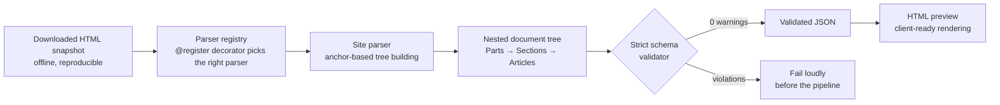
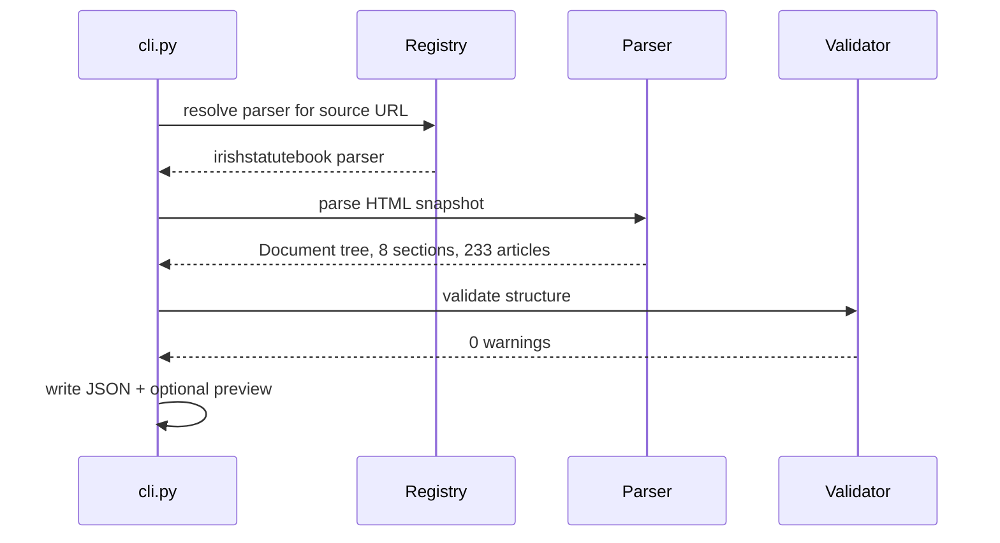

# Regulatory HTML Parser Framework

[](https://github.com/boheastill/gov-doc-parser-framework/actions/workflows/ci.yml)

A robust, offline-first Python framework for parsing unstructured regulatory and government HTML documents into strictly validated JSON schemas. 

Built specifically to handle high-volume document extraction pipelines with complex nested hierarchies, obfuscated DOMs, and inconsistent legacy HTML structures.

## 🚀 Features

- **Anchor-Based Tree Building**: Correctly maps flat HTML anchors (`<a name="part1">`, `<a name="sec1">`) into deep nested JSON trees (Parts → Sections → Articles).
- **Automated Structural Validation**: Built-in strict JSON schema validator catches empty fields, malformed trees, and duplicate article codes before they ever reach the pipeline.
- **Metadata Extraction**: Recursively extracts hidden JSON-LD metadata (`schema:description`) to capture long titles and contextual document data.
- **Clean Architecture**: Uses a `@register` decorator pattern so adding a new source (like a new government site) is as simple as dropping a new Python file in the `/parsers/` directory.
- **Client-Ready Previews**: Includes a tool to dynamically re-render the parsed JSON back into interactive HTML UI for quick manual review.

## 🏗️ Architecture



From raw statute to validated JSON:




- `core/schema.py`: Defines the strict `Document`, `Section`, and `Article` data classes and slug generation.
- `core/registry.py`: Global parser registry mapping URLs to specific parser implementations.
- `core/validator.py`: Automated CI validation rules.
- `parsers/`: Directory for individual site implementations. 
- `cli.py`: Command-line interface for batch processing offline files.

## 📊 Proof of Execution (Irish Statute Book)

This framework has been strictly tested against `irishstatutebook.ie`. It doesn't just parse the simple examples; it handles massive, real-world acts flawlessly. 

All of the following acts pass `validator.py` with 0 warnings:

| Document | Scale | Validation Status |
|----------|-------|-------------------|
| Markets in Financial Instruments Act 2018 | 3 Sections, 10 Articles | ✅ OK |
| Social Welfare Act 2024 | 4 Sections, 12 Articles | ✅ OK |
| National Cultural Institutions Act 2023 | 5 Sections, 16 Articles | ✅ OK |
| Finance Act 2020 | 6 Sections, 77 Articles | ✅ OK |
| **Data Protection Act 2018** | **8 Sections, 233 Articles** | ✅ **OK** |

## 💻 Usage

The parser is designed to work fully offline against downloaded HTML snapshots.

```bash
# Parse a downloaded act and output structured JSON
python cli.py fixtures/irishstatutebook/data_protection_act_2018.html \
  --url https://www.irishstatutebook.ie/.../print.html \
  -o output/data_protection_act.json

# (Optional) Generate a client-ready HTML UI preview from the parsed JSON
python generate_preview.py output/data_protection_act.json -o preview.html
```

## 🛠️ Stack
- Python 3.x
- BeautifulSoup4
- Pytest (for structural CI tests)

---

*Built by [Bohea Still](https://boheastill.com/?r=gh-govdoc) — independent developer taking on automation, AI-pipeline and hardware↔software integration projects. [Case studies →](https://boheastill.com/?r=gh-govdoc)*
